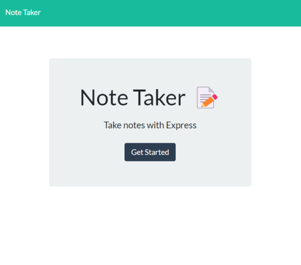
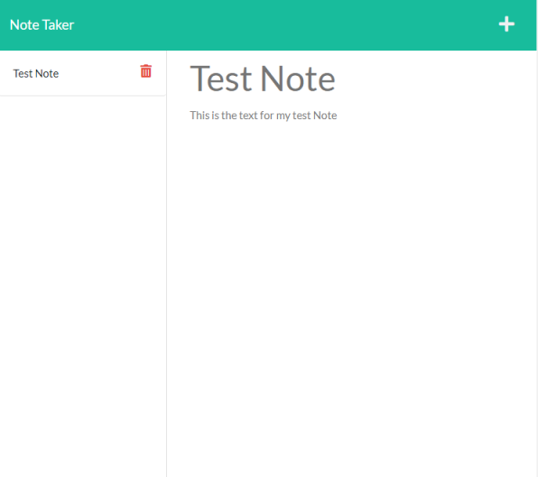

# Note Taker

An app that allows the user to store their notes with a title and a paragraph area to send to a database while using express for the backend.  
Live page: https://mighty-ridge-88200.herokuapp.com/

[ISC](https://choosealicense.com/licenses/isc/)

## Table Of Contents

- [Usage](#usage)
- [Install](#install)
- [Contribute](#contributing)
- [Testing](#tests)
- [Licenses](#licenses)
- [Questions](#questions)

## Usage

To use, run `node index.js` to start the app.

## Install

When you have this project, run `npm install` to install the dependences in the packagejson file.

## Overview

## Contributing

Fork project, add changes, and send a pull request.

## Tests

NA

## Questions

_Reach Out!_

Github: [TDGNate](https://github.com/TDGNate)

Email: itsNzte@gmail.com
